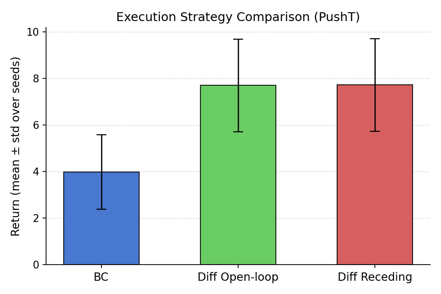
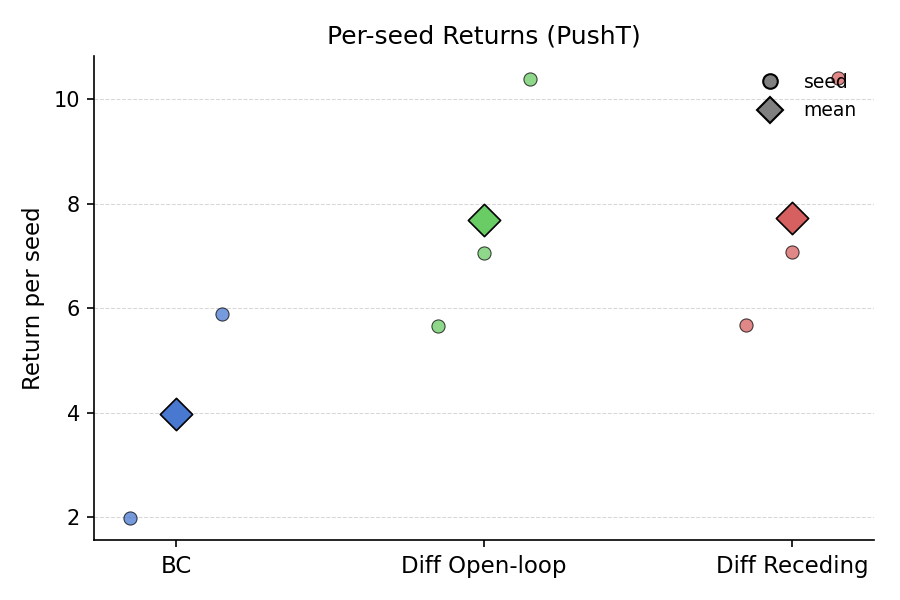

# diffusion-policy-manipulation: Execution Strategy Study for Diffusion-Based Action-Sequence Policies

[](https://github.com/imabhi80/diffusion-policy-manipulation/actions/workflows/ci.yml)
[](https://doi.org/10.5281/zenodo.PLACEHOLDER)

---

## Overview

This repository provides a controlled evaluation study of diffusion-based action-sequence
policies for robotic manipulation. A minimal MLP denoiser is trained on Push-T
demonstrations and evaluated under two execution strategies that differ only at deployment
time, with no modifications to training, architecture, or sampler configuration.

The central research question is: **given a trained diffusion policy that predicts
H-step action sequences, does execution strategy — open-loop chunk execution versus
receding-horizon re-planning — produce a measurable difference in task performance
under identical training conditions?**

Two strategies are compared. Open-loop chunk execution samples the full H-step sequence
once and executes all H actions before re-querying the policy. Receding-horizon
re-planning samples the full H-step sequence at every control step but executes only
the first action, discarding the rest. A Gaussian MLP BC baseline (single-step,
no sequence modeling) is included as an independent reference point.

Evaluation follows a fully deterministic protocol: per-episode reset seeds are fixed
and committed to a SHA-256 hash stored in every output file, diffusion sampling uses
DDIM with eta = 0.0 (deterministic), and all experiments are replicated across three
independently-seeded runs. This repository does not claim improved performance or
propose a new algorithm. It provides a reproducible measurement harness for the
execution-strategy question in a controlled, single-task setting.

---

## Empirical Snapshot

Results below are from the three-seed experiment (`results/rq_exec_mode/`): seeds 0, 1, 2;
20 episodes of random-policy demonstrations per seed; 20 evaluation episodes per method.
See `results/rq_exec_mode/summary.csv` and `results/rq_exec_mode/per_seed.csv` for full CSV outputs.

### Multi-seed summary (Push-T, 3 seeds)

| Method             | return\_mean (mean ± std) | episode\_len\_mean | Seeds |
|--------------------|-------------------------:|--------------------|------:|
| Gaussian BC        |          3.98 ± 1.60      | 200.0 ± 0.0        | 3     |
| Diffusion Open-loop |         7.70 ± 1.99      | 200.0 ± 0.0        | 3     |
| Diffusion Receding |          7.72 ± 1.98      | 200.0 ± 0.0        | 3     |

### Per-seed returns

| Seed | BC return\_mean | Open-loop return\_mean | Receding return\_mean |
|-----:|----------------:|-----------------------:|----------------------:|
| 0    |            1.97 |                   5.65 |                  5.68 |
| 1    |            4.09 |                   7.05 |                  7.07 |
| 2    |            5.88 |                  10.39 |                  10.41 |

> **Interpretation note.** Diffusion sequence modeling outperformed the Gaussian BC
> baseline consistently across all three seeds, with a cross-seed mean return of
> approximately 7.7 versus 4.0 for BC. The difference between open-loop chunk execution
> and receding-horizon re-planning was negligible in this regime (Δ return\_mean ≈ 0.02),
> indicating that execution strategy does not materially affect task return at this
> training and dataset scale. `success_rate` is 0.0 for all methods and seeds; the
> Push-T environment's termination signal does not trigger within 200 steps under the
> evaluated policies, so `return_mean` is the primary metric for this comparison.
> Evaluation uses deterministic (mean) action selection for BC and DDIM eta = 0.0 for diffusion.

### Figures

Bar plot — return\_mean ± std across seeds:



Per-seed scatter with mean marker overlay:



---

## Research Objective

This study addresses one precise evaluation question:

**Does execution strategy affect task return and success rate when applied to a fixed
diffusion policy trained under identical conditions?**

The two strategies evaluated are:

1. **Open-loop chunk execution.** The policy is queried once per H-step chunk. All H
   actions are executed in sequence before re-querying. Re-planning frequency is 1/H of
   the control frequency.

2. **Receding-horizon re-planning.** The policy is queried at every control step.
   Only the first action of the predicted H-step sequence is used; the remaining H-1
   actions are discarded. Re-planning frequency equals the control frequency.

Training data, model architecture, diffusion schedule, sampler configuration, and
evaluation seeds are held constant. Execution strategy is the sole independent variable.

---

## Experimental Protocol

### Environment

| Property          | Value                              |
|-------------------|------------------------------------|
| Environment       | Push-T (`gym_pusht/PushT-v0`)      |
| Observation mode  | State (5-dimensional)              |
| Action space      | Continuous, 2-dimensional          |
| Episode horizon   | 200 steps (max\_steps cap)         |
| Dataset policy    | Uniform random actions             |

### Model Configurations

**Gaussian BC baseline:**

| Hyperparameter | Value |
|----------------|-------|
| Architecture   | MLP, 3 layers × 256 hidden units |
| Output         | Mean + learned scalar log\_std   |
| Loss           | Gaussian NLL                     |
| Optimizer      | Adam, lr = 3 × 10⁻⁴             |
| Batch size     | 256                              |
| Training steps | 3 000                            |

**Diffusion policy (MLP denoiser):**

| Hyperparameter     | Value                   |
|--------------------|-------------------------|
| Architecture       | MLP, 4 layers × 256 hidden units |
| Timestep embedding | Sinusoidal, dim = 64    |
| Noise schedule     | Linear beta, T = 50     |
| beta\_start        | 1 × 10⁻⁴               |
| beta\_end          | 0.02                    |
| Prediction target  | Noise ε (epsilon)       |
| Horizon H          | 8                       |
| Sampler            | DDIM, K = 10 steps, eta = 0.0 |
| Optimizer          | Adam, lr = 3 × 10⁻⁴    |
| Batch size         | 256                     |
| Training steps     | 5 000                   |

### Deterministic Evaluation Protocol

Per-episode seeds are fixed across all methods. Episode `i` resets the environment
with seed `eval_seed + i`. The full list of reset seeds is hashed to a 16-character
SHA-256 prefix (`eval_seed_list_hash`) stored in every output JSON.

Diffusion sampling seeds are derived deterministically: `episode_seed + chunk_index`
for open-loop, `episode_seed + timestep_index` for receding-horizon. No global RNG
state is consumed between samples.

### Multi-seed Aggregation

Three seeds (0, 1, 2) are run independently via `scripts/reproduce_multiseed.py`.
Each seed records its own dataset and trains from scratch. Per-seed JSON outputs are
validated by `scripts/validate_results.py` before aggregation. `scripts/aggregate_results.py`
computes cross-seed mean and population standard deviation (ddof = 0) and writes
`per_seed.csv` and `summary.csv`.

---

## Determinism Guarantees

| Target              | Operation                                                  |
|---------------------|------------------------------------------------------------|
| Python `random`     | `random.seed(seed)`                                        |
| NumPy global        | `np.random.seed(seed)`                                     |
| PyTorch CPU         | `torch.manual_seed(seed)`                                  |
| PyTorch CUDA        | `torch.cuda.manual_seed_all(seed)`                         |
| cuDNN               | `deterministic=True`, `benchmark=False`                    |
| Gymnasium env       | `env.reset(seed=seed)`                                     |
| Action/obs spaces   | `space.seed(seed)`                                         |
| Training batches    | Fresh `np.random.RandomState(seed + step)` per step        |
| Diffusion noise     | Fresh `torch.Generator(seed + step + 777)` per step        |
| DDIM sampling       | Fresh `torch.Generator` per call, seeded from episode + index |

Given identical arguments, two evaluation runs produce byte-identical JSON output.

---

## Installation

Python >= 3.10 required.

```bash
git clone https://github.com/imabhi80/diffusion-policy-manipulation.git
cd diffusion-policy-manipulation
python -m venv .venv && source .venv/bin/activate
pip install -e .
pip install -r requirements.txt
```

The Push-T environment requires a one-line patch to `gym_pusht/envs/pusht.py` on
pymunk 7.2 (replace the removed `Space.add_collision_handler` call):

```python
# Replace:
self.collision_handeler = self.space.add_collision_handler(0, 0)
self.collision_handeler.post_solve = self._handle_collision
# With:
self.space.on_collision(0, 0, post_solve=self._handle_collision)
self.collision_handeler = None
```

---

## Smoke Tests

Each smoke test runs in under two minutes on CPU. Run in order after installation.

```bash
python scripts/smoke_determinism.py          #  seeding + env
python scripts/smoke_dataset.py              #  dataset recording
python scripts/smoke_bc.py                   #  BC training + eval
python scripts/smoke_diffusion_sampler.py    #  DDIM sampler
python scripts/smoke_execution_modes.py      #  execution wrappers
python scripts/smoke_diffusion_train_eval.py #  diffusion train + eval
python scripts/smoke_multiseed.py            #  multi-seed pipeline
```

All smoke tests exit with code 0 on success.

---

## Reproducibility

### Regenerating main results (3 seeds)

```bash
# Full multi-seed pipeline: record → train BC → eval BC → train diffusion → eval diffusion
python scripts/reproduce_multiseed.py \
    --seeds 0 1 2 \
    --env_id gym_pusht/PushT-v0 \
    --episodes_record 20 --max_steps_record 200 \
    --steps_bc 3000 --steps_diff 5000 \
    --episodes_eval 20 --max_steps_eval 200 \
    --results_root results/rq_exec_mode \
    --device cpu

# Validate all per-seed output files exist and are complete
python scripts/validate_results.py \
    --seeds 0 1 2 \
    --results_root results/rq_exec_mode

# Aggregate across seeds
python scripts/aggregate_results.py \
    --seeds 0 1 2 \
    --results_root results/rq_exec_mode

# Generate figures
python scripts/plot_summary.py \
    --summary_csv results/rq_exec_mode/summary.csv \
    --out_path    results/rq_exec_mode/summary_plot.png

python scripts/plot_per_seed.py \
    --per_seed_csv results/rq_exec_mode/per_seed.csv \
    --out_path     results/rq_exec_mode/per_seed_plot.png
```

### Repository structure

```
src/diffusion_policy_manipulation/   core library
    data/        dataset loading and normalization
    envs/        Push-T environment wrapper
    models/      BC policy, MLP denoiser, diffusion schedule, DDIM sampler
    train/       BC and diffusion training loops
    eval/        rollout evaluator, execution-strategy wrappers

scripts/         training, evaluation, reproduction, smoke, plotting
configs/         per-experiment configuration files
data/            datasets (gitignored)
runs/            checkpoints and training logs (gitignored)
results/         per-seed JSON outputs and aggregated CSVs (gitignored)
report/
    figures/         PNG plots for README and documentation
    experiment_log.md
docs/
    protocol.md          exact dataset, training, and evaluation protocol
    research_question.md academic framing and empirical outcome
    threat_model.md      scope limitations and non-goals
tests/
```

---

## Limitations

- **Single environment.** All experiments use Push-T with 5-dimensional state. Results
  may not transfer to other tasks, observation modalities, or action spaces.
- **Random-action demonstrations.** The dataset is collected with a uniform random
  policy. State-space coverage is broad but sparse; the dataset does not reflect expert
  behavior.
- **Fixed horizon.** Sequence length H = 8 is held constant. The effect of horizon on
  the execution-strategy comparison is not studied.
- **Fixed sampler.** DDIM with K = 10 steps and eta = 0.0 is used throughout.
- **No vision.** Observations are low-dimensional state vectors only.
- **No transformer backbone.** The denoiser is an MLP.
- **Simulation only.** No sim-to-real transfer is attempted.
- **success\_rate = 0.0.** The Push-T termination signal does not trigger under the
  evaluated policies; `return_mean` is the operative metric.

---

## Future Directions

- Larger demonstration datasets collected with a task-conditioned or goal-reaching policy.
- Vision-conditioned denoiser with a frozen convolutional encoder.
- Profiling inference latency on accelerated hardware to quantify the real cost of
  receding-horizon re-planning at robot control frequencies.
- Intermediate execution strategies (execute K < H actions before re-planning).
- Transfer to a second environment to test the generality of the execution-strategy finding.

---

## Citation

```bibtex
@software{diffusion_policy_manipulation_2026,
  author  = {Jain, Abhinav},
  title   = {diffusion-policy-manipulation: Execution Strategy Study for
             Diffusion-Based Action-Sequence Policies},
  year    = {2026},
  url     = {https://github.com/imabhi80/diffusion-policy-manipulation},
  doi     = {10.5281/zenodo.PLACEHOLDER},
  version = {1.0.0},
}
```
